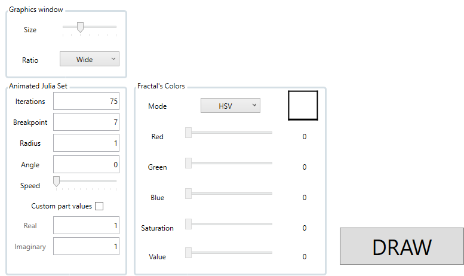
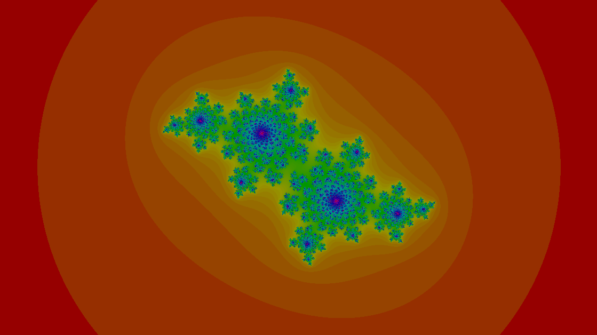
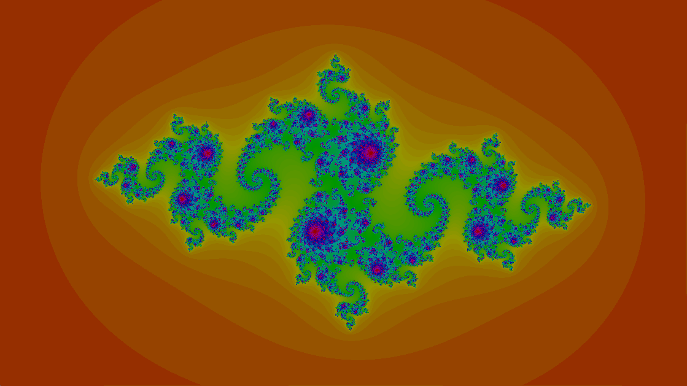
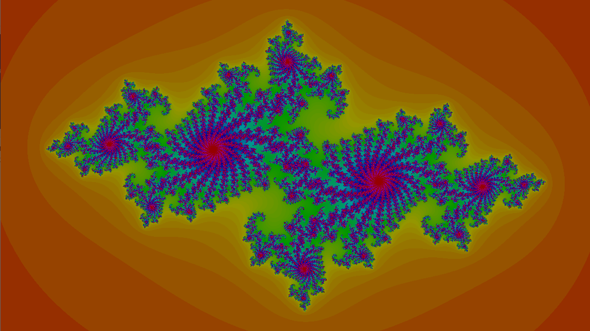

# Fractals using SFML .NET

> WPF program for calculating and drawing fractals.

## Table of contents

- [Application](#fractals-using-sfml-.net)
  - [Table of contents](#table-of-contents)
  - [General info](#general-info)
  - [Technologies](#technologies)
  - [Setup](#setup)
  - [Features](#features)
  - [Youtube video](#youtube-video)
  - [Screenshots and gifs](#screenshots-and-gifs)
  - [Status](#status)
  - [Why did I create it](#why-did-i-create-it)
  - [Contact](#contact)

## General info

Application allows user to generate or even animate fractal with given parameters. The drawing window can be configured too, by size and window's ratio.

## Technologies

* Windows Presentation Foundation
* XAML
* .NET Core 6.0
* C# 9.0

## Setup

TBD

## Features

* Easy to use
* Multiple options to configure
* Animation can be stopped at any moment
* Real time changes
* Zoom in/out
* Move camera

To upgrade:

* Apply async to maximize performance
* Add more fractals

## Youtube video

TBD - now it's link to my account - 
[Check how it works!](https://www.youtube.com/channel/UCj8v_5Ox7-KI5v_2PtMgQSw)

## Screenshots and gifs

## Status

Project is _expansionable_.

That means it is finished and I like how it works. But I am open to any issues connected to it (such as bug fix or adding new features in the long long future).

## Why did I create it

The first version I made was using bad library for animations and has no graphic interface and because I like fractals so much I decided to reacreate it using better solution: [SFML.NET](https://www.sfml-dev.org/download/sfml.net/) library.

## Contact

You can find contact information [here](https://jacek-jendrzejewski.azurewebsites.net/Contact).
